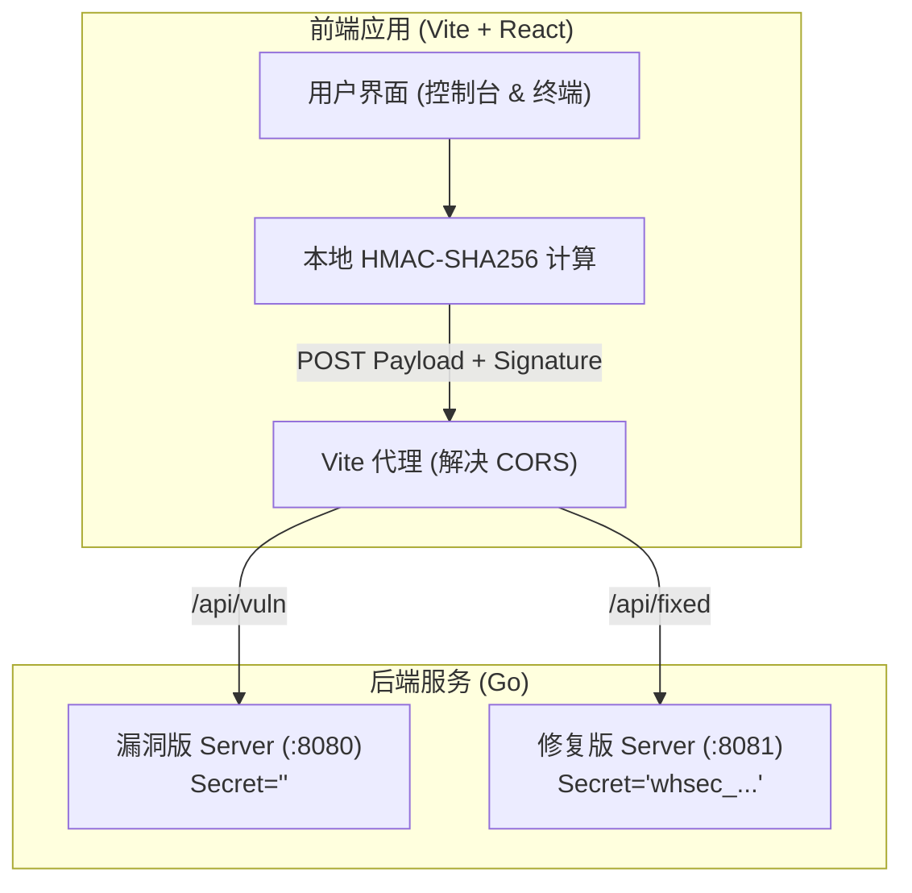

## 1. 架构设计


## 2. 技术栈描述
- **前端框架**: React@18 + TypeScript
- **构建工具**: Vite
- **样式与组件**: TailwindCSS@3 + Lucide React (Icons)
- **加密与请求**: `crypto-js` (生成 HMAC-SHA256 签名)，原生 `fetch` API。
- **初始化工具**: `npm create vite@latest . -- --template react-ts`

## 3. 路由定义
| 路由 | 目的 |
|-------|---------|
| `/` | 唯一的单页应用 (SPA) 主页，包含控制台和终端展示 |

## 4. API 定义 (与本地 Go 后端的交互代理)

前端将通过 Vite Proxy 调用以下两个本地后端（需要确保 Go 后端已启动在对应的 8080 和 8081 端口）。

- **目标**: `POST /api/vuln/api/stripe/webhook` (映射到 `localhost:8080`)
- **目标**: `POST /api/fixed/api/stripe/webhook` (映射到 `localhost:8081`)

**请求 Header**:
```http
Content-Type: application/json
Stripe-Signature: t={timestamp},v1={v1_hash}
```

**请求 Body (JSON)**:
```typescript
interface StripeEventPayload {
  id: string;
  type: "checkout.session.completed";
  data: {
    object: {
      id: string;
      client_reference_id: string;
      status: "complete";
      payment_status: "paid";
      amount_total: number;
    };
  };
}
```

**响应 (Response)**:
- `200 OK` - 攻击成功（验签通过并执行充值）。
- `400 Bad Request` - 攻击失败（验签失败）。

## 5. 跨域 (CORS) 与代理配置
在 Vite 开发环境中配置 `server.proxy`：
```typescript
export default defineConfig({
  server: {
    proxy: {
      '/api/vuln': {
        target: 'http://localhost:8080',
        changeOrigin: true,
        rewrite: (path) => path.replace(/^\/api\/vuln/, '')
      },
      '/api/fixed': {
        target: 'http://localhost:8081',
        changeOrigin: true,
        rewrite: (path) => path.replace(/^\/api\/fixed/, '')
      }
    }
  }
})
```
这允许前端直接向代理地址发起请求，绕过本地浏览器的同源策略限制，而无需修改现有的 `server.go` 和 `server_fixed.go` 代码。

## 6. 数据模型 (无)
前端无持久化数据存储，所有的请求和响应数据保留在内存（React State）中供终端展示。