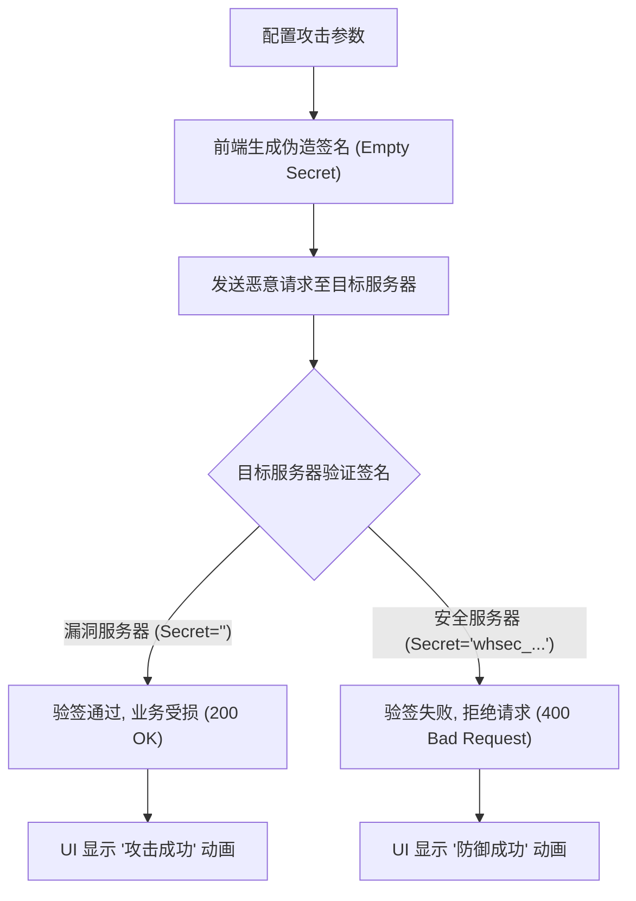

## 1. 产品概述
一个用于演示和测试 Stripe Webhook 签名伪造（空密钥）漏洞的现代化前端测试界面。
- 帮助安全研究人员和开发者直观地理解“零元充值”攻击的原理和防御机制。
- 提供可视化的攻击流程、自定义载荷注入，以及实时请求和响应的反馈展示。

## 2. 核心功能

### 2.1 用户角色
| 角色 | 注册方式 | 核心权限 |
|------|---------------------|------------------|
| 测试者 | 无需注册 | 构造恶意 Payload、发送请求、查看攻防结果 |

### 2.2 功能模块
1. **控制面板 (Dashboard)**: 选择攻击目标（存在漏洞的服务 / 已修复的服务）、配置攻击参数（目标用户 ID、伪造充值金额、使用的 Secret）。
2. **可视化终端 (Terminal Output)**: 实时显示发出的 HTTP Header（特别是伪造的 Stripe-Signature）、请求体 (JSON) 和服务端的真实响应（状态码和结果）。
3. **原理解析 (Explainer)**: 图形化展示五阶段攻击链路，并在执行攻击时高亮当前阶段。

### 2.3 页面详情
| 页面名称 | 模块名称 | 功能描述 |
|-----------|-------------|---------------------|
| 主页 (Home) | 攻击配置区 | 表单输入：目标环境（端口 8080 或 8081）、充值金额、用户 ID 等参数 |
| 主页 (Home) | 攻击执行按钮 | 触发计算伪造 HMAC-SHA256 签名，并发送 POST 请求 |
| 主页 (Home) | 实时终端区 | 打印请求头、请求体、响应状态码、服务端返回信息 |
| 主页 (Home) | 流程图例 | 静态展示或步骤高亮的 Stripe 签名伪造五步图解 |

## 3. 核心流程
1. 测试者在界面上配置攻击参数（目标用户 ID: `USR-9999`，充值金额: `9999`）。
2. 界面前端通过 JS 脚本（或 Node 代理）自动使用空字符串 `""` 加上当前时间戳计算 HMAC-SHA256 签名。
3. 组装恶意 JSON Payload 和伪造的 `Stripe-Signature` 请求头。
4. 向配置的目标后端（漏洞版 `8080` 或 修复版 `8081`）发送 POST 请求。
5. 前端接收服务端响应，并在“终端区”展示攻击是成功（返回 200，零元充值成功）还是失败（返回 400，验签失败）。

## 4. 用户界面设计

### 4.1 设计风格
- **主色调与强调色**: 深色模式 (Dark Mode)，背景使用极深灰色 (如 `#0F172A`)。强调色为赛博朋克风格的荧光绿 (Hack Success) `#10B981` 和警示红 (Hack Failed) `#EF4444`。
- **按钮样式**: 略微带发光阴影的扁平化按钮，悬停时发光增强，传达“执行黑客攻击”的科技感。
- **字体与大小**:
  - UI 字体: `Inter` 或 `Roboto`，清晰现代。
  - 代码/终端字体: `Fira Code` 或 `JetBrains Mono`，用于显示 Payload 和签名字符串。
- **布局风格**: 左右分栏或网格布局（左侧：控制面板与原理图；右侧：终端输出和请求细节）。
- **图标/装饰**: 使用终端图标 `>_`，锁 🔒（安全），以及骷髅头 💀 或闪电 ⚡（攻击）。

### 4.2 页面设计总览
| 页面名称 | 模块名称 | UI 元素 |
|-----------|-------------|-------------|
| 主页 | 顶部导航 | 标题 "Stripe Webhook Vulnerability Tester"，红色漏洞警告徽章 |
| 主页 | 攻击控制台 (左侧) | Card 样式表单，输入框带背景色 `#1E293B`，边框 focus 时高亮。包含目标下拉框、用户ID输入框、金额滑动条/输入框，底部巨大 "EXECUTE ATTACK" 发光按钮 |
| 主页 | 终端输出台 (右侧) | 黑色控制台背景，绿色代码字体输出，带闪烁光标，支持语法高亮显示 JSON 和 Headers |

### 4.3 响应式
桌面端优先 (Desktop-first)，提供完整的左右分栏宽屏体验；移动端自适应 (Mobile-adaptive)，转为上下堆叠布局（表单在上，终端在下）。
